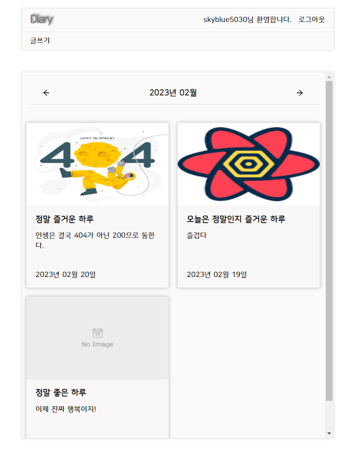
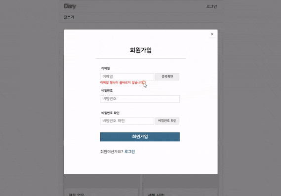
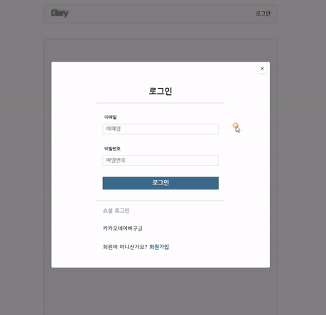
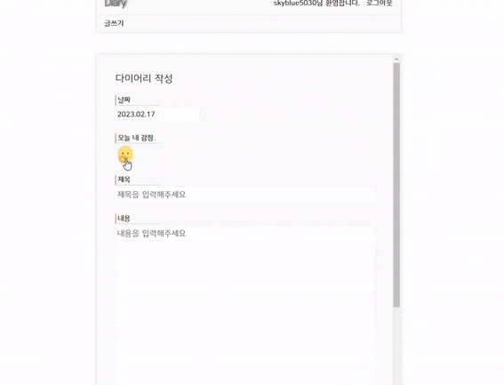
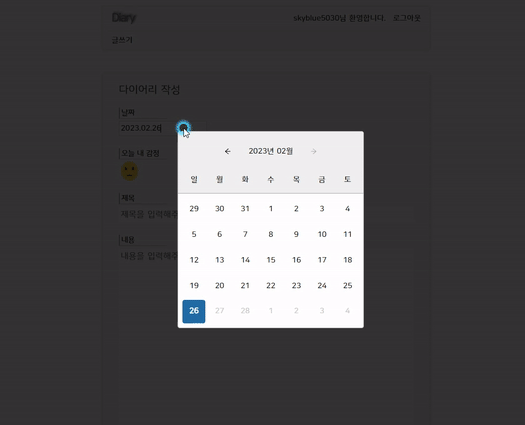
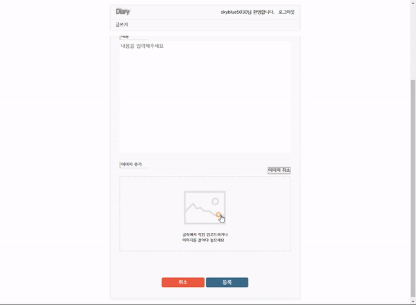
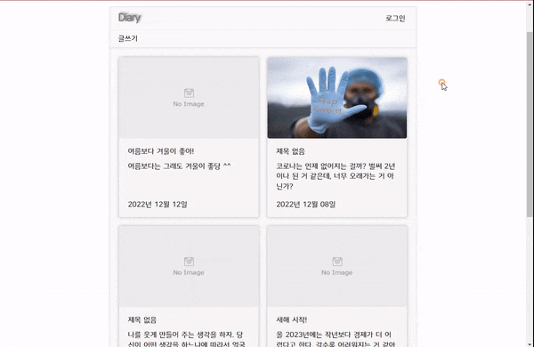
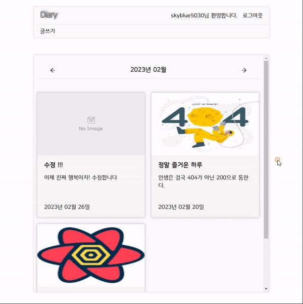
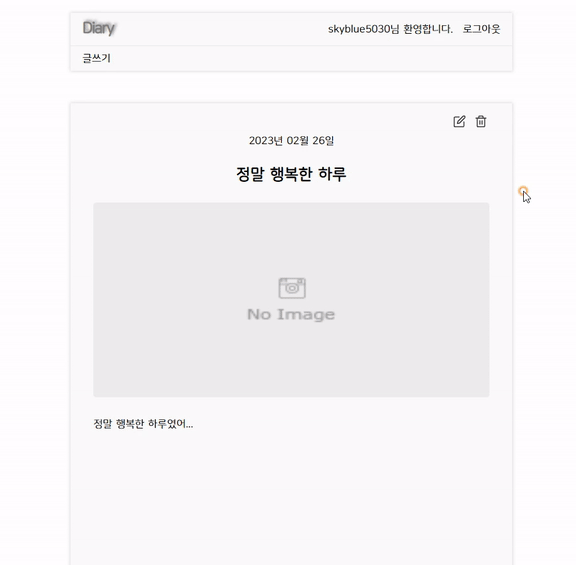

# 🐣 Diary

  

# 📋 프로젝트 설명

일상을 기록할 수 있는 다이어리앱입니다.

  

# 🛠 기술 스택

- react
- react-router-dom (v6)
- rtk(@reduxjs/toolkit)
- emotion
- firebase

(기타)

- react-icons
- react-datepicker
- date-fns
- sweetalert2

  

# 🔘 구현 기능 설명

## 1. 회원가입

  

### 기능 상세
- 이메일 중복확인, 이메일이 존재할 경우 알림 
- 회원가입 유효성 검사 
- 중복 확인 및 비밀번호 확인 완료되면 버튼 비활성화 처리

 

## 2. 로그인

### 기능 상세
- 로그인 성공, 실패시 알림 

 

## 3. 다이어리 글쓰기

### &nbsp; 3.1. 오늘의 감정 선택

### 기능 상세
- 모달로 띄우기 위해 모달 컴포넌트 구현
- 오늘의 감정을 선택하면, 500 밀리초후 닫히도 처리 

 

### &nbsp; 3.2. 오늘 날자 선택 (datepicker)

### 기능 상세
- 날짜 선택은 react-datepicker 라이브러리 사용
- 오늘 날짜 이후의 날짜는 선택되지 않게 처리

 

### &nbsp; 3.3. 이미지 업로드

### 기능 상세
- Firebase에서 제공하는 Storage를 사용하여 이미지 업로드 구현

 

## 4. 다이어리 목록 / 상세 페이지(메인)

### 기능 상세
- 메인 화면에 다이어리 항목 출력, 애니메이션 효과 적용
- 다이어리 항목 선택하면 상세 페이지로 이동
- 상세 페이지에서는 다이어리 상세 화면 출력 및 수정 / 삭제할 수 있게 처리

 

## 5. 다이어리 수정

### 기능 상세
- 다이어리 수정 기능 구현
- 수정 후 알람 

 

## 6. 다이어리 삭제

### 기능 상세
- 다이어리 삭제 기능 구현
- 삭제하기전 알람

  

# 🔘 링크

### ● [프로젝트 설명 및 개발 방식 정리 (노션)](https://www.notion.so/dong-hyun/Diary-0abdc2eff4c94b6eb743c60eeda13c7e)

### ● [프로젝트 개발 과정 (블러그)](https://blog.naver.com/skyblue5030)

  

# 📝 회고
이 다이어리는 학습 차원으로 진행한 프로젝이다. 그래서 기본적인 기능들 위주로 구현했다. 이것을 만들기전 기획은 우선 개발할 수 있는 기본적인 기능들을 개발해서 완료한 후, 하나씩 기능들을 추가해서 확장시켜 나가는 방식으로 진행하기로 했다. 

브런치명을 버전명으로 정한 이유도 그런 이유이다. 

아직 이미지 처리부분에 미흡한 부분이 있어서 수정하고, 좀 더 기능들을 추가해볼 예정이다. 

아래는 프로젝트를 하면서 해결했던 점이나 기록하고 싶은 것을 정리한 내용이다. 

 

### 1. 모달창 구현하기 
모달창을 재사용하기 위해 컴포넌트를 구현했는데 상태를 동일하게 관리해서 모달창을 열때, 인증창이랑 감정을 선택하는 모달창 둘 다 열리는 문제가 생겼다. 그래서 이 모달 상태를 리덕스 툴킷으로 관리하고 각각 이름을 다르게 해서 관리하는 방식으로 해결했다. 

이렇게 구현하니 해결은 되었지만, "모달창이 추가될 때마다 다른 이름으로 상태를 추가하며 관리"해야 하는 문제가 생겼다. 이부분은 나중에 좀 더 찾아보고 해결할 생각이다. 

[관련 코드 보기](https://github1s.com/donghyunami/diary/blob/ver1/src/components/base/Modal/index.jsx)

 

### 2. 감정 모달창 
감정을 선택할 수 있게 감정 모달창을 구현했다. 감정을 선택하고 닫을 때 애니메이션을 적용했지만 바로 닫히게 되어 뭔가 어색했다. 

그래서 딜레이를 주고자 setTimeout을 활용해 500밀리초후 닫히도록 처리했다. 

이렇게 딜레이를 줘서 처리했더니 애니메이션 효과가 잘 적용되어 부드럽게 잘 작동했다. 

[관련 코드 보기](https://github1s.com/donghyunami/diary/blob/ver1/src/components/DiaryForm/SelectEmotion/index.jsx)
